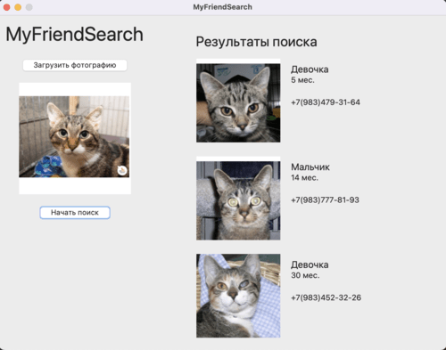

# my-friend-search

Приложение для нахождения похожих домашних котов по фотографии



## Данные 

Фотографии котов, используемые для приложения были взяты из открытого источника [Kaggle: Cat VS Dog Dataset](https://www.kaggle.com/datasets/karakaggle/kaggle-cat-vs-dog-dataset)

## Модель

Для поиска похожих изображений используется предварительно обученная модель ResNet50, которая обучалась распознавать 21к объектов. 
Таким образом, полученные эмбеддинги этой нейросетью очень хорошо кодируют изображения. Получая эмбеддинг изображения, мы находим 3 самых близких эмбеддинга других изображений котов. 

## Запуск приложения

Для первого запуска нужно установить все необходимые библиотеки из requirements.txt

```.bash
pip install -r requirements.txt
```
Далее используем команду 

```.bash
python3 app.py
```

Для первого запуска приложения требуется доступ к интернету для скачивания всех необходимых библиотек. 
Также потребуется некоторое время для скачивания модели и запуска приложения. 

